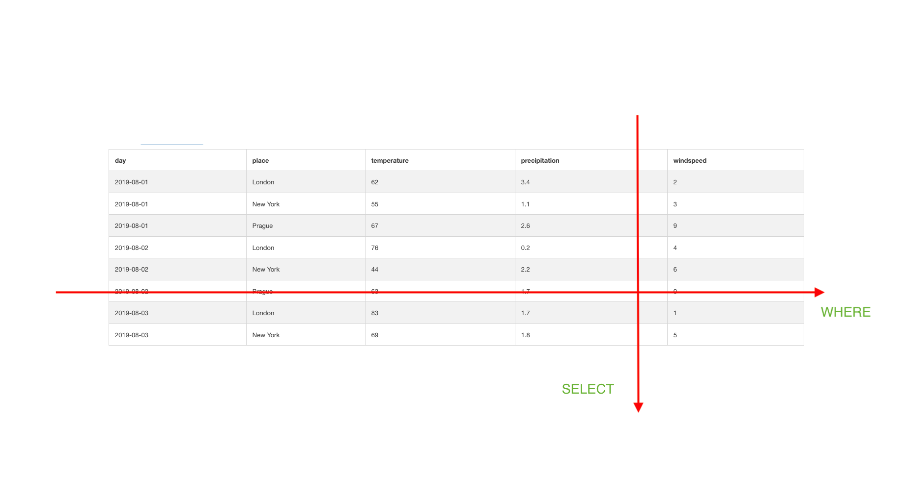

# SQL: the database query language
> database purpose: store data


> question: how to query data from a database?

### outline
1. concept
2. demo
3. exercises
4. conclusion / further reading

## concept
> what does a database look like?

- db = {table1, table2, table3..}
- table looks as follows.. it has rows and columns 
- can slice table in 2 directions
- can run aggregate functions



## demo
- DbFiddle [link](https://www.db-fiddle.com/)


```
# db-schema & data

CREATE TABLE record (
    day DATE NOT NULL COMMENT 'day of measurement',
    place VARCHAR(80) NOT NULL COMMENT 'place of measurement',
    temperature TINYINT UNSIGNED COMMENT 'temperature in Fahrenheits',
    precipitation DECIMAL(3,1) COMMENT 'precipitation in mm',
    windspeed TINYINT UNSIGNED COMMENT 'windspeed in m/s',
    PRIMARY KEY (day, place)
);


INSERT INTO record (day, place, temperature, precipitation, windspeed) VALUES
('2019-08-01','Prague','67','2.6','9'), ('2019-08-02','Prague','63','1.7','0'), ('2019-08-03','Prague','64','1.3','9'), ('2019-08-04','Prague','41','3.0','3'), ('2019-08-05','Prague','90','1.3','6'), ('2019-08-06','Prague','89','1.5','9'), ('2019-08-07','Prague','73','2.0','0'),
('2019-08-01','London','62','3.4','2'), ('2019-08-02','London','76','0.2','4'), ('2019-08-03','London','83','1.7','1'), ('2019-08-04','London','90','2.8','0'), ('2019-08-05','London','88','1.5','6'), ('2019-08-06','London','40','3.7','9'), ('2019-08-07','London','61','3.4','9'),
('2019-08-01','New York','55','1.1','3'), ('2019-08-02','New York','44','2.2','6'), ('2019-08-03','New York','69','1.8','5'), ('2019-08-04','New York','80','1.4','6'), ('2019-08-05','New York','74','1.9','4'), ('2019-08-06','New York','49','1.7','2'), ('2019-08-07','New York','45','1.2','3')
;
```


```
# basic queries
SELECT * FROM record;
SELECT day, place, temperature FROM record LIMIT 4;  # slice vertically
SELECT * FROM record WHERE place='Prague' LIMIT 4;   # slice horizontally

# aggregate functions
SELECT place, COUNT(*) FROM record GROUP BY place;  # count records for each place
SELECT place, SUM(precipitation) FROM record GROUP BY place;  # sum precipitation for each place


```


## [exercises](http://sqlzoo.net)

## further reading
(MariaDB vs MySQL)
- in simplified terms: MySQL is the default choice of an SQL-database, and MariaDB is an alias for MySQL
- (_in more detail: MariaDB is a fork (a clone) of MySQL, since MySQL was bought by Oracle -- i.e. they are very similar, but developed by different people_)


(tutorials)
- SQL Zoo https://sqlzoo.net/
- SQL Bolt https://sqlbolt.com/
- MariaDB Primer https://mariadb.com/kb/en/a-mariadb-primer/

(sql-environment)
- [DB Fiddle](https://www.db-fiddle.com/)
- [MariaDB in Docker](https://mariadb.com/kb/en/installing-and-using-mariadb-via-docker/) (advanced)

(documentation)
- MariaDB https://mariadb.com/kb/en/select/
- MySQL https://dev.mysql.com/doc/refman/8.0/en/select.html

(SQL vs NoSQL)

(NoSQL databases)
- MongoDB https://www.mongodb.com/
